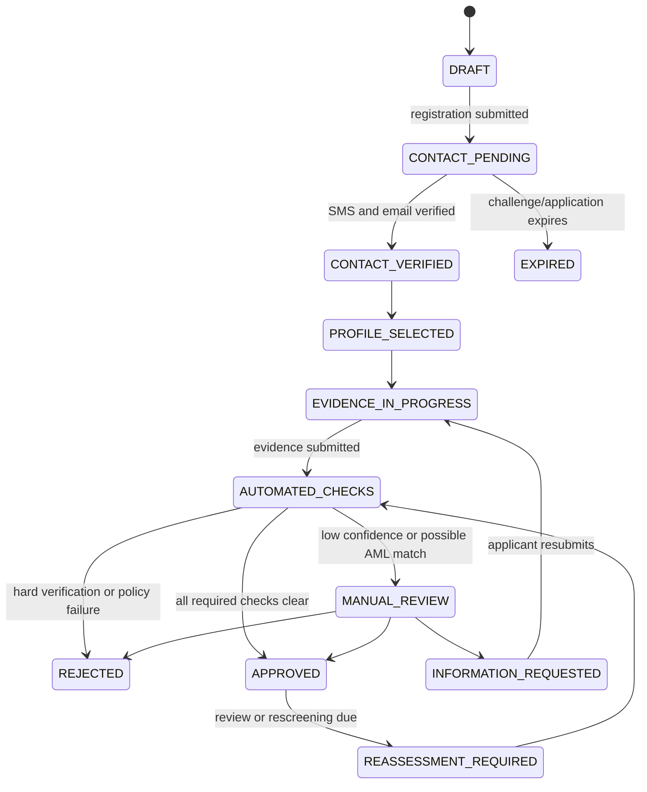

# Onboarding and KYC/AML Microservice Specification

**Version:** 1.0
**Status:** Proposed
**Source:** Switsh mobile prototype, “Onboarding & KYC/AML” (BRD §5)
**Audience:** Product, compliance, backend, mobile, operations, and security teams

## 1. Purpose and scope

This service owns the customer onboarding lifecycle from registration through KYC/KYB decisioning and ongoing AML screening. It provides a single source of truth for:

- account-registration eligibility, contact verification, and acceptance of terms;
- individual identity verification (KYC), including document validation, OCR, liveness, and facial match;
- business verification (KYB), including legal-entity, representative, and beneficial-owner information;
- risk data collection, sanctions/PEP/adverse-media screening, case management, and KYC-tier assignment;
- a compliance decision and the entitlements or limits it produces.

The service does **not** authenticate customers after onboarding, hold funds, execute payments, or perform mobile-device biometric matching. The identity provider performs biometric analysis; the identity/authentication service owns credentials and login. This service receives only the outcome needed to make a compliance decision.

The implementation must support the Democratic Republic of the Congo (DRC) as the initial market. References in the prototype to BCC, ARPTC, CENAREF, UN, and FATF/GAFI are product requirements to be validated and approved by Legal/Compliance before production launch. Regulatory rules, document types, thresholds, lists, and retention periods must be configurable rather than hard-coded.

## 2. Definitions

| Term | Meaning |
|---|---|
| Applicant | A person beginning registration before a customer record is approved. |
| Customer | An approved individual or legal entity with a stable `customerId`. |
| KYC | Know Your Customer verification for an individual. |
| KYB | Know Your Business verification for a legal entity and its associated persons. |
| UBO | Ultimate beneficial owner; a natural person with an ownership or control interest in a business. |
| PEP | Politically exposed person. |
| Screening | Search against sanctions, PEP, adverse-media, and internal-watchlist data. |
| Case | A manual-review work item created when automated decisioning cannot approve or reject safely. |
| Tier | A configured KYC level that controls product eligibility and transaction limits. |
| Provider | An external OCR, liveness, document-verification, screening, or registry service. |

## 3. Functional requirements

### 3.1 Registration and contact verification

1. An applicant registers with a unique DRC mobile number, email address, password, and accepted terms.
2. The mobile number must normalize to E.164 and, for the DRC launch, match `+243` followed by nine digits. The service stores the normalized value, never a display-only format.
3. Email validation follows the application’s approved email-validation policy; it must be normalized for uniqueness according to the chosen canonicalization policy.
4. Both contact points are unique among active and pending records. Reuse after account closure is a policy-controlled exception with an audit trail.
5. The service issues a six-digit SMS OTP with a five-minute validity period and three verification attempts per challenge, as shown in the prototype.
6. OTP resend is rate-limited and invalidates or supersedes the prior active challenge. The concrete resend and registration rate limits are configuration values.
7. A registration becomes eligible for identity collection only after successful SMS OTP verification and verified email ownership. Email verification may run in parallel with contact verification.
8. The acceptance record must capture the immutable terms/privacy-policy versions, acceptance timestamp, locale, applicant ID, and client metadata.
9. Password and PIN values are outside this service’s persistence boundary. It may orchestrate calls to the authentication service but must never return or log secrets.

### 3.2 Customer type and tax residence

1. An applicant selects exactly one customer type: `INDIVIDUAL` or `BUSINESS`.
2. An applicant provides a tax-residence country. DRC is the initial UI default but must not be inferred silently.
3. The customer type determines the required verification journey:
   - `INDIVIDUAL`: KYC identity, personal-information, risk-profile, and optional/required proof-of-address steps.
   - `BUSINESS`: KYB legal-entity information, legal-representative KYC, and one or more UBO records.
4. Changing customer type after a verification submission invalidates dependent data and requires a new or reset application; it must not silently mix individual and business evidence.

### 3.3 Individual KYC

1. Supported DRC identity document types are `CENI`, `ONIP_NIN`, `BIOMETRIC_PASSPORT`, and `RESIDENCE_PERMIT`. The allowed list is configuration by country and customer type.
2. The applicant provides document number, issue date, expiry date, front image, a back image when the document is two-sided, and a liveness selfie capture.
3. The service validates dates before provider submission:
   - issue date is before the current business date;
   - expiry date is after the current business date;
   - document number satisfies the configured document-type pattern;
   - the same valid document is not already bound to another active customer, subject to fraud and legal policy.
4. The document provider returns extracted fields and a field-level confidence score. The prototype’s auto-processing threshold is **85% per required field**. A result below threshold creates a manual-review case; it must not auto-approve.
5. The liveness/facial-match provider returns independent liveness and face-match outcomes and scores. A provider `NO_GO`, spoof detection, or a score below the active configured threshold rejects the verification automatically unless Compliance explicitly configures a review path for that provider reason.
6. The service compares provider-extracted identity data with applicant-entered personal data. Material conflicts (name, date of birth, or document number) create a case or reject based on configured decision rules.
7. An individual must be at least 18 years old on the submission date. Applicants below the threshold are rejected with a non-sensitive reason code.
8. Required personal data is: surname, given names, date and place of birth, sex, nationality, full address, city/commune/district, occupation, and declared source of income. Estimated monthly income is optional.

### 3.4 Proof of address and tier 3

1. Proof of address supports residence attestation, REGIDESO/SNEL bill, certified geolocation, and declaration on honor.
2. The service requires an issue date and validates configured maximum age; the prototype indicates three months as the recommended maximum.
3. A scanned image or PDF is required except for certified geolocation. Certified geolocation requires an attested location payload and consent; raw coordinates must be handled as sensitive personal data.
4. Proof of address is an input to tier assignment. It may be required before granting the highest tier; it must not unnecessarily block a lower-tier approval.
5. If the address evidence cannot be automatically trusted, the application enters manual review rather than receiving a higher tier.

### 3.5 Business KYB

1. Required legal-entity data is legal name, RCCM number, NIF, legal form, incorporation date, business sector, registered address, legal representative name and role, representative identity evidence, and at least one UBO.
2. Annual turnover is optional and is used only for configured risk and recommended-limit calculations.
3. Legal form and sector use controlled, versioned code lists. The prototype’s initial examples are `SARL`, `SA`, `SOLE_PROPRIETORSHIP`, and `OTHER`, and sectors such as general trade, import-export, services, and agribusiness.
4. RCCM and NIF syntax and, where an approved integration exists, registry status must be validated. Format validation alone must not be presented as registry verification.
5. The legal representative undergoes the same individual identity rules as an individual customer. The business cannot be approved while the representative’s verification is unresolved or failed.
6. UBO records are repeatable and contain full name, date of birth, nationality, residence country, ownership percentage, control role, and identity-verification reference.
7. The aggregate declared ownership must not exceed 100%. The prototype labels this an alert; this service treats it as a submission validation error because it produces inconsistent ownership data. Lower totals may be accepted only when supported by a declared control structure or a reviewer decision.
8. Each UBO requiring verification under the active policy must complete KYC and AML screening before a business is approved.

### 3.6 AML screening and risk assessment

1. Screening is required before approval for individuals, business entities, legal representatives, and required UBOs.
2. The screening adapter must support sanctions, PEP, internal-watchlist, and adverse-media sources. The prototype cites CENAREF, UN, and FATF/GAFI; the actual provider/source coverage must be approved and configured by Compliance.
3. Screening requests include only the minimum necessary identity data and use a stable subject reference. Provider responses are stored with provider version, list version or search timestamp, candidate identifiers, match score, disposition, and correlation ID.
4. A potential match must never be auto-cleared merely because its confidence is low. The configured matching policy determines whether it is `CLEAR`, `POSSIBLE_MATCH`, or `CONFIRMED_MATCH`; all non-clear outcomes create or update a compliance case unless an approved rule rejects immediately.
5. Risk scoring uses explicit versioned factors, including nationality/residence, occupation, business sector, source of funds, expected income/turnover, product risk, and screening outcome. The score explanation must be retained.
6. The service performs rescreening on configured events: periodic review due, material profile change, UBO change, list update, and explicit compliance request.
7. The service creates suspicious-activity or regulatory-reporting work items when configured detection policies require them. It does not file external reports directly unless that responsibility is explicitly assigned and approved.

### 3.7 Decisioning, tiering, and remediation

1. Automated decisions are deterministic, versioned, explainable, and recorded with their input snapshot.
2. The service assigns a tier only when all required evidence and mandatory screenings for that tier are satisfactory.
3. The initial tier model is:

| Tier | Minimum evidence | Outcome |
|---|---|---|
| `TIER_1` | Configured minimum registration/contact evidence | Restricted account eligibility and configured low limits |
| `TIER_2` | Verified identity, age check, clear screening, and completed individual/KYB requirements | Standard account eligibility and intermediate limits |
| `TIER_3` | `TIER_2` plus satisfactory proof of address and any enhanced-due-diligence requirements | Higher limits and enabled products as configured |

4. Tier limits, enabled capabilities, and upgrade criteria are policy configuration. The KYC service publishes tier entitlements; downstream ledger/card/payment services enforce their own limits from that entitlement.
5. Applicants can remediate eligible rejection or review reasons by replacing documents or correcting data. New evidence creates a new immutable verification attempt; it does not overwrite historical evidence.
6. Manual reviewers can approve, reject, request information, or escalate a case. Every manual decision needs a reason code, decision note, reviewer identity, timestamp, and optional four-eyes approval where configured.

## 4. State model

### 4.1 Application lifecycle



Terminal states are `REJECTED` and `EXPIRED`. `APPROVED` is not terminal because periodic review, rescreening, or a material change can create `REASSESSMENT_REQUIRED`. State changes are append-only events and use optimistic concurrency through the application `version`.

### 4.2 Verification statuses

Each verification component uses: `NOT_STARTED`, `PENDING`, `PROCESSING`, `PASSED`, `FAILED`, `REVIEW_REQUIRED`, `EXPIRED`, or `CANCELLED`.

The overall compliance status exposed to channels is `PENDING`, `VERIFIED`, `REJECTED`, `REVIEW_REQUIRED`, `SUSPENDED`, or `EXPIRED`. A customer is `VERIFIED` only after an approval decision; a component pass alone is not a customer-level verification.

## 5. Data model

All identifiers are UUIDv7 or another sortable, globally unique identifier. Monetary values use integer minor units plus ISO 4217 currency. Timestamps are UTC ISO 8601; dates have no time component. Data classifications are `PUBLIC`, `INTERNAL`, `CONFIDENTIAL`, and `RESTRICTED`.

| Entity | Key fields | Classification |
|---|---|---|
| `OnboardingApplication` | `id`, `version`, `customerType`, `state`, `country`, `contactStatus`, `riskLevel`, `kycTier`, `createdAt`, `updatedAt` | Confidential |
| `Contact` | `applicationId`, `type`, encrypted normalized value, `verificationStatus`, `verifiedAt` | Restricted |
| `TermsAcceptance` | `applicationId`, terms/privacy versions, accepted timestamp, locale, client metadata | Confidential |
| `PersonProfile` | legal names, DOB, birthplace, sex, nationality, residence, occupation, source of funds, income band | Restricted |
| `LegalEntity` | legal name, RCCM, NIF, form, incorporation date, sector, address, turnover band | Restricted |
| `AssociatedPerson` | application ID, role (`LEGAL_REPRESENTATIVE`/`UBO`), person reference, ownership percent, control role | Restricted |
| `IdentityDocument` | type, encrypted document number, dates, issuing country, image-object references, status | Restricted |
| `VerificationAttempt` | evidence snapshot hash, provider, provider correlation ID, result, reason codes, score references, policy version | Restricted |
| `ScreeningResult` | subject, screening type, provider, source/list version, result, candidates, disposition, screened timestamp | Restricted |
| `RiskAssessment` | score band, factor values, policy version, explanation, assessed timestamp | Restricted |
| `ComplianceCase` | case type, severity, status, queue, assignee, SLA, decision, reason codes | Confidential |
| `TierEntitlement` | customer ID, tier, capability set, limit-profile ID, effective period, decision reference | Confidential |
| `AuditEvent` | actor, action, entity reference, before/after hashes, correlation ID, timestamp | Confidential |

Sensitive fields must use field-level encryption or a dedicated encrypted PII store. Document images, selfie media, and address artifacts reside in object storage under private, immutable object keys; the database contains only references, content hash, MIME type, size, capture time, malware-scan result, and retention metadata. Do not persist raw biometric templates unless Legal and the selected provider contract explicitly authorize it.

## 6. API contract

The service exposes REST/JSON APIs under `/v1`. Internal calls use workload identity; mobile calls go through the API gateway and customer authentication layer. All write endpoints require an `Idempotency-Key` header. Requests carry `X-Correlation-Id`; the service generates one when absent and returns it in every response.

### 6.1 Public/channel endpoints

| Method and path | Purpose | Success response |
|---|---|---|
| `POST /applications` | Start an application and record registration data | `201` application |
| `GET /applications/{applicationId}` | Retrieve applicant-safe progress and next required actions | `200` application summary |
| `POST /applications/{applicationId}/contacts/phone/otp` | Issue or resend SMS OTP | `202` challenge metadata |
| `POST /applications/{applicationId}/contacts/phone/verify` | Verify SMS OTP | `200` contact status |
| `POST /applications/{applicationId}/contacts/email/verify` | Consume verified email token | `200` contact status |
| `PUT /applications/{applicationId}/profile-selection` | Set customer type and tax residence | `200` application |
| `POST /applications/{applicationId}/documents/upload-sessions` | Get constrained direct-upload instructions | `201` upload session |
| `POST /applications/{applicationId}/identity-documents` | Attach document metadata and uploaded artifacts | `202` document verification |
| `PUT /applications/{applicationId}/personal-profile` | Save individual personal/risk data | `200` profile |
| `PUT /applications/{applicationId}/proof-of-address` | Submit address evidence or certified location reference | `202` verification |
| `PUT /applications/{applicationId}/business-profile` | Save legal-entity data | `200` business profile |
| `POST /applications/{applicationId}/associated-persons` | Add legal representative or UBO | `201` associated person |
| `PUT /applications/{applicationId}/associated-persons/{personId}` | Update an associated person before submission | `200` associated person |
| `POST /applications/{applicationId}/submit` | Validate completeness and start decision workflow | `202` decision status |
| `GET /applications/{applicationId}/status` | Return compliance status, tier, and applicant-safe next action | `200` status |

Example registration request:

```json
{
  "phoneNumber": "+243912345678",
  "email": "mireille@example.cd",
  "terms": {
    "termsVersion": "2026-09-01",
    "privacyPolicyVersion": "2026-09-01",
    "accepted": true
  }
}
```

The gateway sends password setup to the authentication service in the same user journey. If this endpoint accepts a credential reference, it may accept only an opaque, short-lived reference minted by that service; it must not accept a raw password.

Example status response:

```json
{
  "applicationId": "0198b207-c6eb-7e9a-bd9e-0e24c3f493f8",
  "state": "APPROVED",
  "complianceStatus": "VERIFIED",
  "kycTier": "TIER_2",
  "nextActions": [
    {
      "code": "OPTIONAL_PROOF_OF_ADDRESS",
      "message": "Provide proof of address to request Tier 3."
    }
  ],
  "updatedAt": "2026-09-22T20:00:00Z"
}
```

### 6.2 Operations and compliance endpoints

These endpoints require the `compliance.case.read` or `compliance.case.write` scope and are inaccessible to customers.

| Method and path | Purpose |
|---|---|
| `GET /v1/cases` | Search cases by status, queue, type, customer/application reference, or SLA |
| `GET /v1/cases/{caseId}` | Retrieve a complete reviewer view with controlled PII access |
| `POST /v1/cases/{caseId}/assignments` | Assign or reassign a case |
| `POST /v1/cases/{caseId}/information-requests` | Request defined evidence from the applicant |
| `POST /v1/cases/{caseId}/decisions` | Approve, reject, escalate, or close a case |
| `POST /v1/applications/{applicationId}/rescreen` | Start authorized rescreening |
| `POST /v1/applications/{applicationId}/reassessments` | Start periodic or event-driven reassessment |
| `GET /v1/policies/{policyVersion}` | Retrieve approved, non-secret policy metadata |

### 6.3 Validation and error format

Use RFC 9457 Problem Details with stable codes. Never reveal whether a phone, email, document number, or sanctioned person belongs to another customer.

```json
{
  "type": "https://api.switsh.example/problems/validation-error",
  "title": "The request is invalid.",
  "status": 422,
  "code": "DOCUMENT_EXPIRED",
  "correlationId": "a8d6d1cb-d5fd-4fa6-a22c-1e81701aa8a0",
  "errors": [
    {
      "field": "expiryDate",
      "code": "MUST_BE_IN_FUTURE"
    }
  ]
}
```

Use `400` for malformed requests, `401`/`403` for authentication/authorization, `404` only when disclosure is safe, `409` for state/version/idempotency conflicts, `422` for business validation, `429` for throttling, and `503` for a dependency outage. Provider indeterminacy must result in a pending/retry/review state, not a success-shaped response.

## 7. Asynchronous processing and events

Synchronous APIs validate and persist commands. Long-running document analysis, screening, risk assessment, registry lookup, email delivery, and notifications run asynchronously. Publish events transactionally through an outbox; consumers must be idempotent using `eventId` and aggregate version.

| Event | Producer condition | Required payload |
|---|---|---|
| `onboarding.application.created.v1` | Application created | application ID, customer type pending, correlation ID |
| `onboarding.contact.verified.v1` | Phone or email verified | application ID, contact type, verified timestamp |
| `kyc.document.submitted.v1` | Identity document accepted for processing | application ID, document ID, document type, attempt ID |
| `kyc.verification.completed.v1` | OCR/liveness/document decision completed | application ID, attempt ID, outcome, reason codes, policy version |
| `aml.screening.completed.v1` | Screening disposition recorded | subject reference, screening ID, disposition, source version |
| `compliance.case.created.v1` | Review case created | case ID, application/customer ID, type, severity, SLA |
| `compliance.decision.made.v1` | Final or case decision recorded | decision ID, application/customer ID, outcome, tier, reason codes |
| `kyc.tier.changed.v1` | Entitlement changes | customer ID, prior tier, new tier, limit-profile ID, effective time |
| `kyc.reassessment.required.v1` | Periodic/event review is due | customer ID, trigger, due date |

Events contain references and decision metadata, not raw PII, document numbers, media URLs, OTPs, or detailed screening candidates.

## 8. Integrations

| Integration | Direction | Responsibility | Failure behavior |
|---|---|---|---|
| Authentication service | Bidirectional | Credential setup reference, account activation, security events | Registration remains incomplete; never store credential fallback |
| SMS provider | Outbound | OTP delivery | Retry within policy; return pending/rate-limited outcome |
| Email provider | Outbound | Email-verification delivery | Retry within policy; registration cannot progress until verified |
| Document/OCR provider | Outbound/webhook | Document extraction and authenticity result | Mark verification pending; retry or create case after configured timeout |
| Liveness/face-match provider | Outbound/webhook | Liveness and similarity decision | Fail closed to review/reject according to configured reason mapping |
| AML screening provider | Outbound | Sanctions/PEP/watchlist/adverse-media screening | Block approval and create dependency-pending/review case |
| Business registry | Outbound | RCCM/NIF validation where available | Do not claim verification; create review or allow policy-approved fallback |
| Object storage and malware scanner | Outbound/event | Encrypted evidence storage and scan | Evidence is unusable until scan passes |
| Customer/CRM service | Outbound events | Customer creation/update after compliance approval | Use outbox retries; do not roll back approved compliance decision |
| Limits/entitlements service | Outbound events | Enforce tier capabilities and limits | Reconcile/retry and alert; do not falsely show entitlement as active |

Provider webhooks require mutual authentication or signed requests, replay protection, timestamp validation, provider correlation lookup, schema validation, and idempotent processing. Provider result mappings are versioned configuration.

## 9. Security, privacy, and audit

1. Enforce least-privilege OAuth/OIDC scopes and workload identities. Operations roles must separate case assignment, evidence viewing, decisioning, policy administration, and audit access.
2. Encrypt all restricted data in transit and at rest. Use envelope encryption with managed keys, rotation, access logging, and separate keys or tenants for high-risk evidence where supported.
3. Store only signed, short-lived upload/download URLs. Validate content type, size, magic bytes, image/PDF decodability, malware scan, and image decompression limits before provider processing.
4. Redact PII, document numbers, biometric outcomes, OTPs, authorization headers, and provider credentials from logs, traces, metrics, error messages, and events.
5. Hash OTPs using a slow keyed verifier or approved OTP-verification service; never store the OTP in plaintext. Enforce rate limits by application, phone, IP/device signal, and provider response.
6. Keep immutable, tamper-evident audit events for all material data access, evidence changes, screening outcomes, case actions, policy versions, tier changes, and consent records.
7. Apply data minimization, configurable retention, legal hold, deletion/anonymization workflows, and data-subject request handling. Retention and deletion are approved Compliance/Legal configuration, not application constants.
8. Restrict manual reviewers to masked fields by default. Evidence decryption and full-value searches require purpose-based access, elevated authorization, and audit logging.
9. Do not use customer-entered sensitive data to train models or expose it to non-approved analytics systems.

## 10. Non-functional requirements

| Area | Requirement |
|---|---|
| Availability | Target 99.9% monthly API availability excluding planned maintenance and external-provider outages; status must reflect dependency-pending states. |
| Performance | `GET` status endpoints: p95 under 300 ms excluding gateway. Command acceptance endpoints: p95 under 700 ms; provider workflows are asynchronous. |
| Reliability | At-least-once event delivery with idempotent consumers; no lost decision, audit, or entitlement event. |
| Consistency | Strong consistency for application state, final decisions, consent, and audit records. Eventual consistency is acceptable for downstream notifications and entitlements, with reconciliation. |
| Observability | Structured logs, traces, metrics, dashboards, and alerts keyed by correlation ID without PII. Track provider latency/error rates, queue age, case SLA breach, screening backlog, decision rates, and tier changes. |
| Accessibility/localization | API messages expose stable codes; channel applications localize human text. Support French first and preserve locale with consent and communication records. |
| Resilience | Circuit breakers, bounded retries with jitter, dead-letter queues, replay tooling, and manual recovery. A provider outage must not auto-approve an applicant. |

## 11. Decision rules and configuration

The following are versioned, approved configuration with an effective date, author, approver, test evidence, and rollback plan:

- allowed document types, country rules, document-number patterns, required sides, and expiry handling;
- OCR field thresholds (initial prototype baseline: 85%), liveness and face-match thresholds, and provider reason mappings;
- age of majority, proof-of-address currency, UBO verification/ownership rules, and legal-entity requirements;
- risk-score factors, weights, risk bands, enhanced-due-diligence triggers, and tier eligibility;
- transaction-limit profile identifiers and product capabilities by tier;
- screening sources, matching thresholds, rescreening cadence, potential-match disposition, and reporting rules;
- OTP lifetime, attempts, resend limits, application expiration, file limits, and operational SLAs;
- retention, legal-hold, masking, and data-residency policies.

Policy evaluation records the exact configuration version and a canonical hash of decision inputs. A configuration change applies prospectively unless a controlled migration/reassessment explicitly selects existing records.

## 12. Acceptance criteria

1. A valid DRC phone number and valid email can begin an application only once, consent is versioned, and neither contact can advance until its verification completes.
2. An OTP expires after five minutes, rejects after three failed attempts, and is never recoverable from storage, logs, or API responses.
3. An individual with an expired document, failed liveness result, or age below 18 cannot reach approval.
4. An OCR result below 85% for any required field creates a review case and cannot auto-approve.
5. A clear KYC identity result plus clear required screening produces the configured tier only when all requirements for that tier are satisfied.
6. A possible sanctions/PEP match produces an auditable case and blocks automated approval until policy resolution.
7. A business application cannot approve unless required legal-entity fields, representative KYC, UBO records, UBO screenings, and ownership validation are complete.
8. Ownership above 100% is rejected at validation; every manual override requires a reason code and audit event.
9. Replacing evidence preserves prior attempts and their decisions. The new attempt is independently traceable.
10. A downstream entitlement consumer can use `kyc.tier.changed.v1` to enforce the current tier without obtaining restricted identity data.
11. An outage or timeout from OCR, liveness, or AML screening leaves the application pending or under review; it never produces an approval.
12. Every final approval, rejection, case decision, and tier change identifies the actor, policy version, reason codes, correlation ID, and timestamp.

## 13. Delivery boundaries and dependencies

The first production increment should provide registration/contact verification, individual KYC, evidence storage, OCR/liveness orchestration, AML screening orchestration, a basic case queue, auditable tier decisions, and tier-change events. KYB, registry checks, sophisticated risk scoring, continuous screening, regulatory reporting workflows, and Tier 3 geolocation can follow behind the same application and policy model.

Before implementation, the product owner and Compliance must approve: the authorized list of regulatory and screening data sources, exact tier limits/capabilities, provider contracts and biometric-data basis, retention schedule/data residency, manual-review SLA and four-eyes rules, refusal/remediation messaging, business-registry coverage, and the risk-scoring/tier decision policy.
